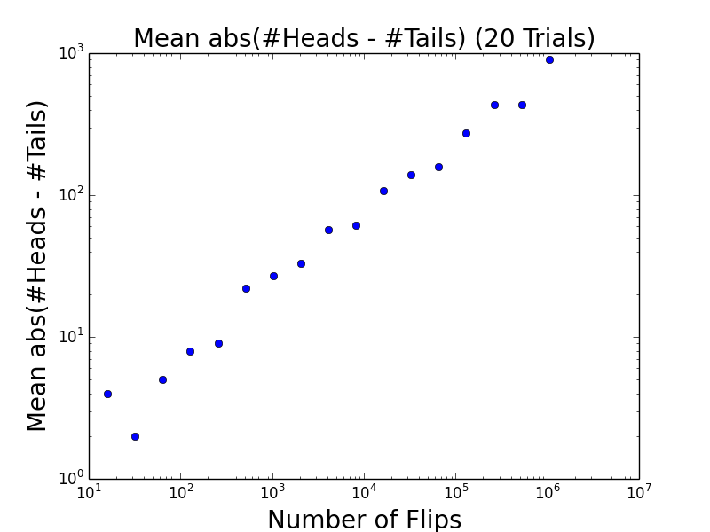

## 大数法则

在数学与统计学中，大数定律又称大数法则、大数律，是描述相当多次数重复实验的结果的定律。根据这个定律知道，样本数量越多，则其平均就越趋近期望值。

大数定律很重要，因为它“保证”了一些随机事件的均值的长期稳定性。人们发现，在重复试验中，随着试验次数的增加，事件发生的频率趋于一个稳定值；人们同时也发现，在对物理量的测量实践中，测定值的算术平均也具有稳定性。比如，我们向上抛一枚硬币，硬币落下后哪一面朝上本来是偶然的，但当我们上抛硬币的次数足够多后，达到上万次甚至几十万几百万次以后，我们就会发现，硬币每一面向上的次数约占总次数的二分之一。偶然必然中包含着必然。

It's worth noting that the law of large numbers does not imply, as too many seem to think, that if deviations from the expected behavior occur, these deviations are likely to be evened out by opposite deviations in the future.

这句话的意思是：大数法则并不表示如果一个结果一直发生，那么接下来发生相反结果的可能性就会增大。

也就是说如果抛硬币无论连续多少次都是head，也不表示下一次是tail的可能性增大，因为每一次抛都是一次独立的事件，事件之间没有相互影响。

这是人们的一种错误的惯性思维。把不确定性与确定性联系了起来。

当你扔10<sup>1,000,000</sup>次硬币的时候，你会看到几个连续的1,000,000万的head，如果你基于此作了判断，那这显然是错误的。也就是我们常说的，只见树木，不见森林。也就是说你不可能只看一个大的随机序列的子集。

而且，如果一个大的随机序列的每个子集都是随机的，反而说明这个大序列不是随机的。如果你iPod shuffle功能从来没有连续播放一首相同的歌，说明它在选择上不是完全随机的。

同样，大数法则也不表示head和tail数目的绝对值趋近于0，实际上你抛的越多，他们直接的绝对值差会越大。只是head和tail的比率趋近于1。比率接近于1比较容易理解，但绝对值之差为什么会越来越大呢？

我们来看code：

```python
def flipPlot(minExp, maxExp):
    """Assumes minExp and maxExp positive integers; minExp < maxExp
       Plots results of 2**minExp to 2**maxExp coin flips"""
    ratios = []
    diffs = []
    xAxis = []
    for exp in range(minExp, maxExp + 1):
        xAxis.append(2**exp)
    for numFlips in xAxis:
        numHeads = 0
        for n in range(numFlips):
            if random.random() < 0.5:
                numHeads += 1
        numTails = numFlips - numHeads
        ratios.append(numHeads/float(numTails))
        diffs.append(abs(numHeads - numTails))
    pylab.title('Difference Between Heads and Tails')
    pylab.xlabel('Number of Flips')
    pylab.ylabel('Abs(#Heads - #Tails)')
    pylab.plot(xAxis, diffs)
    pylab.figure()
    pylab.title('Heads/Tails Ratios')
    pylab.xlabel('Number of Flips')
    pylab.ylabel('Heads/Tails')
    pylab.plot(xAxis, ratios)

random.seed(0)
flipPlot(4, 20)
pylab.show()
```


首先，随着次数的增加，在一开始一小段剧烈浮动之后，正反的比率趋近于1。


但是他们的绝对值之差在增加。但是这个增加的数量之小，于总计抛的次数之比可以忽略不计，这也就是为什么虽然正反绝对值之差越来越大，但是比率却趋近于1。因为两者完全不在一个数量级上，前者对后者的影响可以忽略不计。而且这里的向上的线条有欺骗作用。虽然趋势是向上的，但并不代表没有任何波动。这点要特别注意。


把x轴改为坐标改为logarithmic，并把线改为点，数据的分布情况和趋势就看的更明显。

[Source Code](https://github.com/nickyfoto/Blog/blob/master/MIT.6.00.2x/code/lectureCode_l15-1.py)

* 结论：it's never possible to be assured of perfect accuracy through sampling unless you sample the entire
population.

* 接下来的问题是：how many samples we need to look at before we can have some justification that the conclusion we're reaching really is sound.

---

既然部分永远无法代表全部，但在大多数情况下我们无法sample全部，那sample多少才算够？

做simulation时，我们知道仅仅做一次是不够的。要对多次simulation统计结果进行描述，仅仅给出算术平均也是不够的。我们还要看值的分布情况。这里我们引入Standard Deviation的概念，也就是标准差。

What the standard deviation is telling us is how many
values are close to the mean.

例如，两组数的集合{0, 5, 9, 14}和{5, 6, 8, 9}其平均值都是7，但第二个集合具有较小的标准差。

标准方差的算法：

* 元素之和除以元素数量的到算术平均
* 每个元素于算术平均的差的平方相加，再除以元素数量。
* 开方

```python
def stdDev(X):
    mean = sum(X)/float(len(X))
    tot = 0.0
    for x in X:
        tot += (x - mean)**2
    return (tot/len(X))**0.5
    
def runTrial(numFlips):
    numHeads = 0
    for n in range(numFlips):
        if random.random() < 0.5:
            numHeads += 1
    numTails = numFlips - numHeads
    return numHeads, numTail
```
因为要多次的trial，所以把每一次Trial单独写个function。

```python
def flipPlot(minExp, maxExp, numTrials):
    meanRatios = []
    meanDiffs = []
    ratiosSDs =  []
    diffsSDs =  []
    xAxis = []
    for exp in range(minExp, maxExp + 1):
        xAxis.append(2**exp)
    for numFlips in xAxis:
        ratios = []
        diffs = []
        for t in range(numTrials):
            numHeads, numTails = runTrial(numFlips)
            ratios.append(numHeads/float(numTails))
            diffs.append(abs(numHeads - numTails))
        meanRatios.append(sum(ratios)/numTrials)
        meanDiffs.append(sum(diffs)/numTrials)
        ratiosSDs.append(stdDev(ratios))
        diffsSDs.append(stdDev(diffs))
    pylab.plot(xAxis, meanRatios, 'bo')
    pylab.title('Mean Heads/Tails Ratios ('
                + str(numTrials) + ' Trials)')
    pylab.xlabel('Number of Flips')
    pylab.ylabel('Mean Heads/Tails')
    pylab.semilogx()
    pylab.figure()
    pylab.plot(xAxis, ratiosSDs, 'bo')
    pylab.title('SD Heads/Tails Ratios ('
                + str(numTrials) + ' Trials)')
    pylab.xlabel('Number of Flips')
    pylab.ylabel('Standard Deviation')
    pylab.semilogx()
    pylab.semilogy()
```
[Source Code](https://github.com/nickyfoto/Blog/blob/master/MIT.6.00.2x/code/lectureCode_l15-2.py)


17个点，每个点重复测20组取比率的平均值。



也是因为每个点重复做了20次，可以看出，他们的绝对值之差的平均数是稳步上升的。


把20组的ratio做成一个标准方差。可以看出，抛硬币的次数越多，标准方差越来越小，说明ratio是越来越准确的。


第一个点代表，扔了20组，每组16次，每一组的diff纪录下来，做标准方差。第二个点也是扔了20组，每组32次，每一组的diff纪录下来，做标准方差。以此类推。最后一个点是扔了20组，每组2<sup>20</sup>次，把每一组的diff纪录下来，做的标准方差。

也就是说，随着每组测试扔的次数的增加，每组的diff与该组平均值的差越来越大。但这是不是代表我们的结果越来越不准呢？显然不是。因为standard deviation的数值不能孤立地来看，要跟平均数的变化比较着来看。

也就是说，如果SD同样是100，mean是1,000,000时，我们说SD小；如果mean也是100，则SD很大。这里mean和sd是一同增大的，所以我们看不出变异的大小，这是要引入一个新的概念来帮我们观察测试结果。这就是变异系数。

### 变异系数
这里我们需要引入一个新的概念。coefficient of variation。在概率论和统计学中的变异系数，又称“离散系数”。是概率分布离散程度的一个归一化量度，其定义为标准差与平均值之比。它只在平均值不为零时有定义，而且一般适用于平均值大于零的情况。

也就是说，描述一组数据，有平均值，有标准差。还有他们之比，作为一个和其它组数据比较时候的参数。

[Source Code](https://github.com/nickyfoto/Blog/blob/master/MIT.6.00.2x/code/lectureCode_l15-3.py)


这里用直方图的形式表示出两组数据的异同。同样重复10,000次。

第一组每次抛100次。

第二组每次抛1000次。

通过直方图表现出，第二组数据接近mean的比例更多。也就是说，扔的次数越多，变异系数越小。simulation也就是越接近准确值。