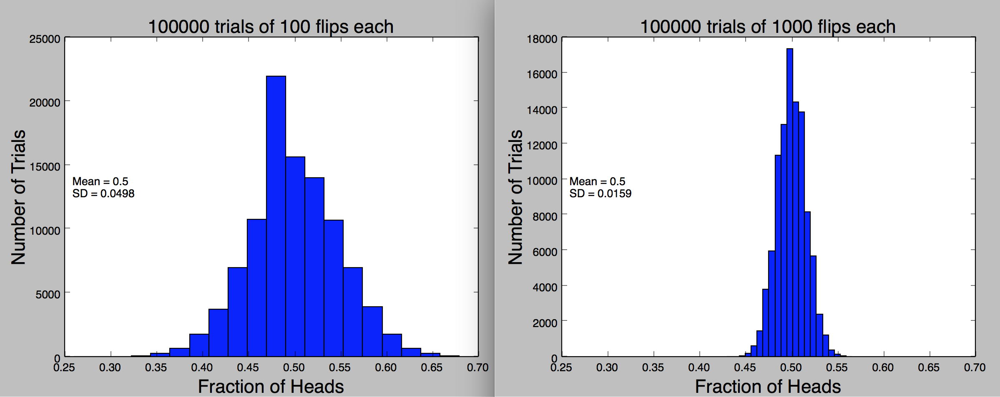
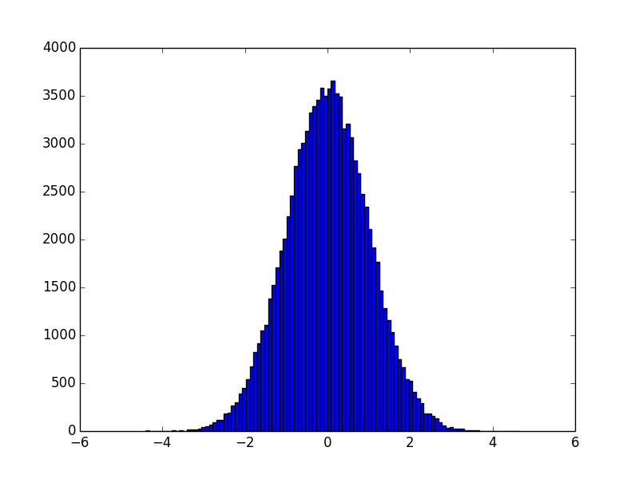
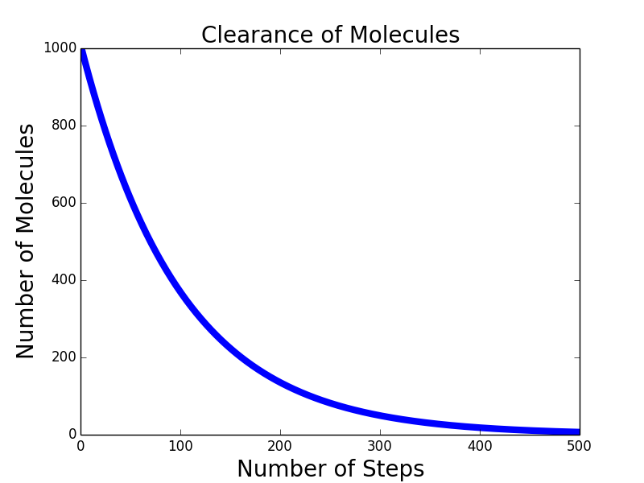
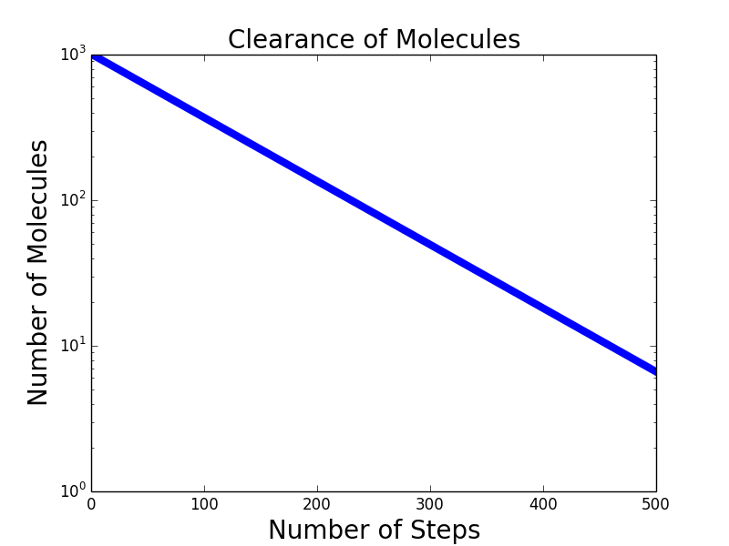
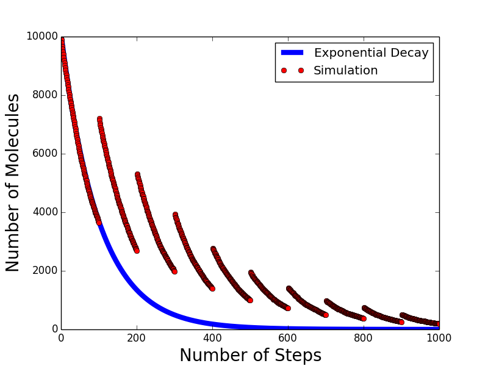
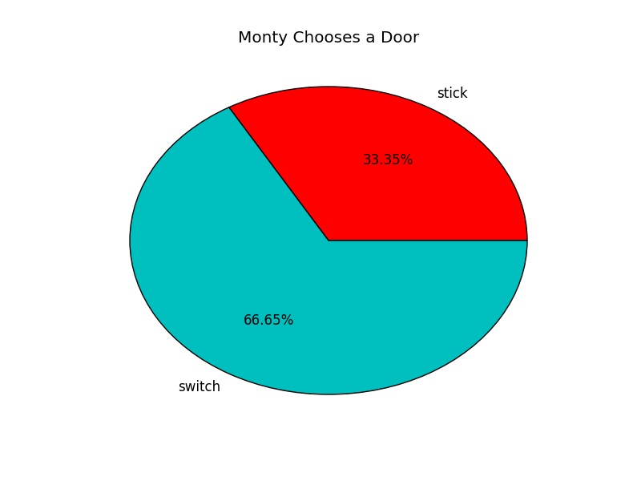
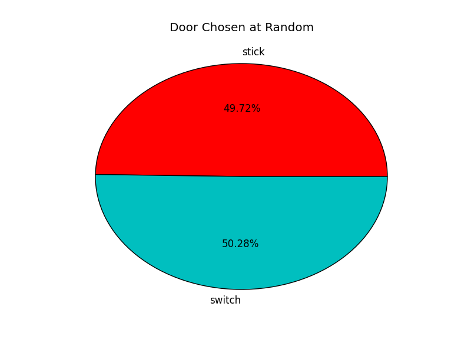

### Normal Distribution



类似这样的数据分布，我们叫Normal Distribution。它有对称性，在平均数处达到峰值。又被称作Gaussian Distribution。它被用于概率研究有两个原因：

1. 很好的数学特性
 *  它由μ（算术平均）和σ（标准方差）两个参数来构成
2. 现实中经常出现

高斯分布在python中也有函数表示`random.gauss()`

```python
import random, pylab

def makeNormal(mean, sd, numSamples):
   samples = []
   for i in range(numSamples):
       samples.append(random.gauss(mean, sd))
   pylab.hist(samples, bins = 101)

makeNormal(0, 1.0, 100000)
pylab.show()
```


For normal distributions, the standard deviation can be used to produce something called a **confidence interval**.

#### Confidence interval(置信区间) 与 Confidence Level(置信水平)

在统计学中，一个概率样本的置信区间（Confidence interval）是对这个样本的某个总体参数的区间估计。置信区间展现的是这个参数的真实值有一定概率落在测量结果的周围的程度。置信区间给出的是被测量参数的测量值的可信程度，即前面所要求的“一定概率”。这个概率被称为**(Confidence Level)置信水平**。举例来说，如果在一次大选中某人的支持率为55%，而**置信水平**95%上的**置信区间**是（50%,60%），那么他的真实支持率有百分之九十五的机率落在百分之五十和百分之六十之间，因此他的真实支持率不足一半的可能性小于百分之2.5（假设分布是对称的）。

对一个给定情形的估计来说，**(Confidence Level)置信水平**。越高，所对应的**置信区间**就会越大。

这两者合在一起来表示预测的准确性。

Confidence interval(置信区间)有一个假设，它假设预测当中错误的分布也是Normal Distribution

从经验上说，一个Normal Distribution

* 68%的数据与mean差一个SD
* 95%的数据与mean差两个SD
* 99.7％的数据与mean差三个SD

因为poll不可能做很多次，所以大部分的poll只做一次，依赖**Standard Error**来支撑。Standard Error是标准方差预测。它假设错误平均分布，而且取样只占全体的很小一部分。

例如取样百分比是p，全体是n

Standard Error ＝ (p(1-p)/n)<sup>1/2</sup>

### Uniform Distribution
另外一种Distribution 是Uniform Distribution。

例如：`random.choice()` `random.random()`。

这在自然界中不常见，一般是人造的。复杂建模中不太用得到。

### Exponential Distribution

They're the only continuous distribution that has the memoryless property. What happens at one stage of the distribution is independent of what happens at other stages.

例如：[inter arrival time](http://blog.simul8.com/simul8-tip-whats-the-difference-between-arrival-rates-and-inter-arrival-times/)

我们看药物分子在身体内被清除的速率。假设被清除率是p

Time | % remained
---  |----------
t<sub>0</sub> | (1-p)<sup>0</sup>
t<sub>1</sub> | (1-p)<sup>1</sup>
t<sub>2</sub> | (1-p)<sup>2</sup>
... | ...
t<sub>k</sub> | (1-p)<sup>k</sup>

下面我们来看一下药物分子在人体内被清除的曲线：

```python
def clear(n, clearProb, steps):
    numRemaining = [n]
    for t in range(steps):
        numRemaining.append(n*((1-clearProb)**t))
    pylab.plot(numRemaining, label = 'Exponential Decay')

clear(1000, 0.01, 500)
pylab.xlabel('Number of Steps')
pylab.ylabel('Number of Molecules')
pylab.title('Clearance of Molecules')
pylab.semilogy()
pylab.show()

# n代表起始分子数，clearProb是清除率，step是过了多少时间。
```


如果我们把y轴变为指数单位：`pylab.semilogy()`，会得出一条直线：

这也是检测数据是否呈指数型下降（或增长）的方法。我们经常听到的半衰期与其同理。

这不是蒙特卡洛模拟，因为我们并没有使用随机的参数。如果我们使用随机参数。

```python
def clearSim(n, clearProb, steps):
    numRemaining = [n]
    for t in range(steps):
        numLeft = numRemaining[-1]
        for m in range(numRemaining[-1]):
            if random.random() <= clearProb: 
                numLeft -= 1
        #if t != 0 and t % 100 == 0:
        #	numLeft += numLeft
        numRemaining.append(numLeft)
    pylab.plot(numRemaining, 'ro', label = 'Simulation')
# 上段代码中每一步分子数＊留下的百分百。
# 这里是每一步，看每个分子，如果随机数小于clearProb，则清除该分子，如果大于clearProb，则保留。
```
它们得出的曲线几乎一致。同时因为随机性的存在，又不会完全重合。随着分子数的减小，随机部分的波动开始增大，因为大数法则不再适用。

换一种情况，假设这里不是药物分子，而是某种病毒或细菌。它们每100个时间单位会克隆一次。得到的图是：


我们可以方便的在simulation中测试各种可能出现的情况。

[Source Code](../sources/lectureCode_clearSim.py)

---

### Monty Hall Problem

故事是这样的。

| No.  | 1  | 2    | 3
|:---: |:---:|:---:|---
|门    | 🚪  | 🚪  |🚪
|随机   | 🐑  |🐑   |🚗

三道门分别是1，2，3号。有两只🐑，一辆🚗，放在三道门后。观众先选择一道门。然后Monty Hall会在余下的两道门中，打开有🐑的那道门（余下两道门中至少有一道后面肯定是🐑，而且Monty Hall是知道的）。再问观众是否坚持他原来的选择。

初想来，这个问题相当于主持人排除掉一只🐑，让观众在余下的🚗和🐑之间随机选择一个。无论怎么选，概率都是1/2。

但事实是这样吗？

第一次选的时候是3选1，正确可能性是1/3，错误可能性是2/3。

接下来Monty要在余下的两个门之间，选择一个后面是🐑的门，关键是他知道哪扇门是🐑，他的选择并不是随机的。也就是说他的选择是受观众第一次选择的影响，所以这不是完全独立的一个选择。

因为他不会主动开有车的那扇门。

所以如果坚持第一种选择，那么中奖率是1/3，不中奖率是2/3。因为Monty后面做的事情对观众没有影响。因为接下来Monty会主动排除掉一只🐑，如果观众switch，会利用Monty这件事的影响来提高中奖率。因为不动的中奖率是1/3，不中奖率是2/3。观众此时只有一个选择，如果坚持，那中奖率还是1/3不变，如果变，则把1/3与2/3倒置，变为中奖率是2/3，不中奖率是1/3。

```python
def simMontyHall(numTrials, chooseFcn):
    stickWins, switchWins, noWin = (0, 0, 0)
    prizeDoorChoices = [1,2,3] #三个门
    guessChoices = [1,2,3] #猜
    for t in range(numTrials):
        prizeDoor = random.choice([1, 2, 3]) #车可能在任意一个门后面
        guess = random.choice([1, 2, 3]) #第一次随机猜
        toOpen = chooseFcn(guess, prizeDoor) #这里给了两种开门方式，一种是Monty节目中的开法，他故意开一扇后面是🐑的，另外一种是Monty随机开，我们对比，来看结果有何不同。
        if toOpen == prizeDoor: #如果开出来是车，观众没赢
            noWin += 1
        elif guess == prizeDoor: #如果观众第一次猜的是车，则stickwin
            stickWins += 1
        else:
            switchWins += 1 #余下的则是switchwin。
    return (stickWins, switchWins)
```
```python
def montyChoose(guessDoor, prizeDoor):
    if 1 != guessDoor and 1 != prizeDoor:
        return 1
    if 2 != guessDoor and 2 != prizeDoor:
        return 2
    return 3
#如果观众没开1号门，而且1号门不中奖，则开1
#如果观众没开2号门，而且2号门不中奖，则开2
#其它开3。
```
```python
def randomChoose(guessDoor, prizeDoor):
    if guessDoor == 1:
        return random.choice([2,3])
    if guessDoor == 2:
        return random.choice([1,3])
    return random.choice([1,2])
#另外一种则是Monty随机开剩下的门。
```

[Source Code](../sources/montyhall.py)

绿色是switch的概率。

如果Monty没有刻意排除一只🐑，而是随便选，则它对观众没有帮助，所以

