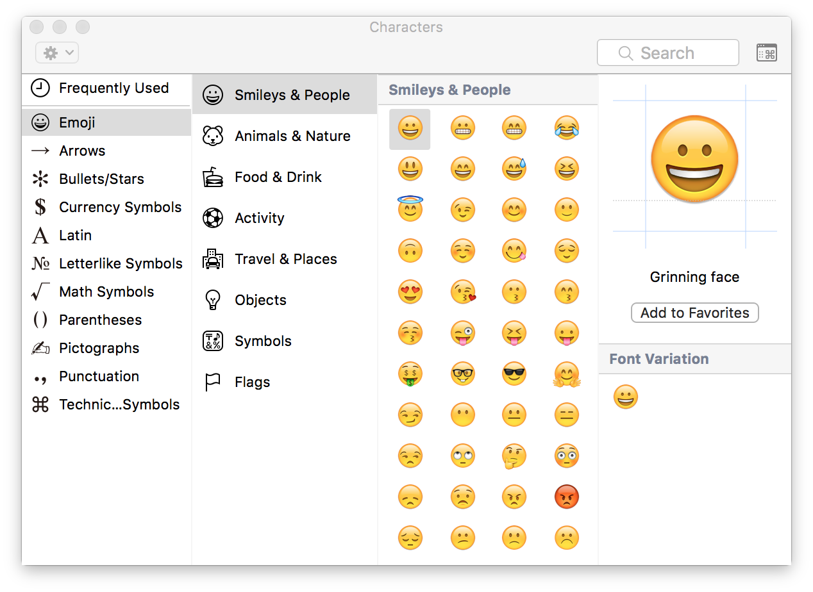
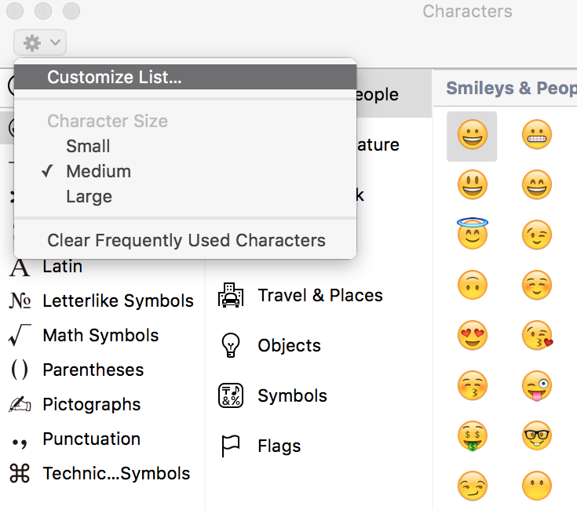
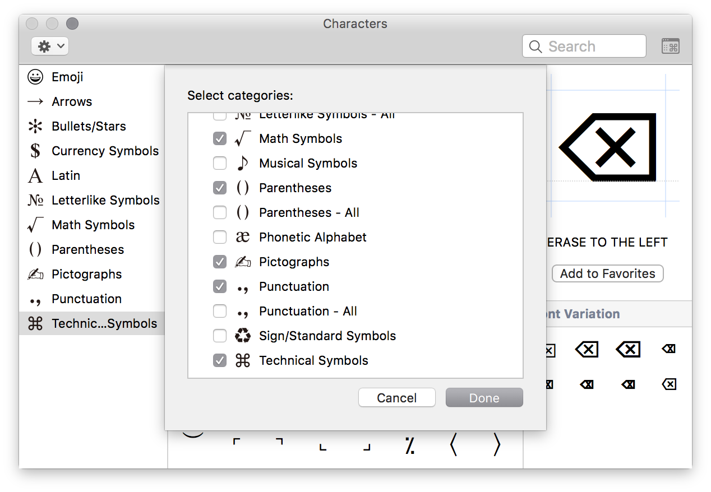
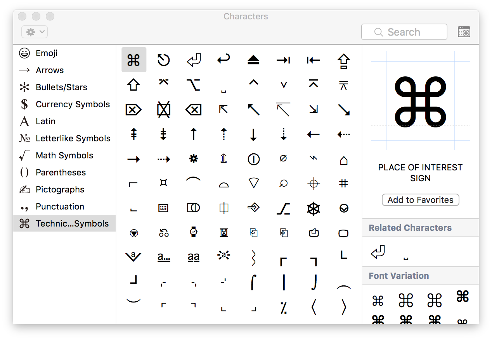

有时候在写文章时我们会输入一些键盘上的符号，例如

key symbol | character
-----------|----------
command    | ⌘
option     | ⌥
return     | ⏎
shift      | ⇧
arrows     |↑↓←→
delete/backspace |⌫
Esc        | ⎋

我们都知道在osx下，点击输入法的Show Emoji & Symbol会调出Emoji以及一些特殊符号的输入面板。

点击左上角的齿轮，选择Customize List...，会出现

在其中选中Technical Symbols

就会有各种⌨️符号出现在Show Emoji & Symbols里面了。

