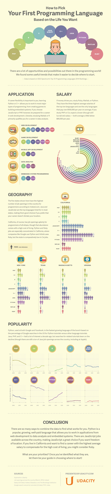
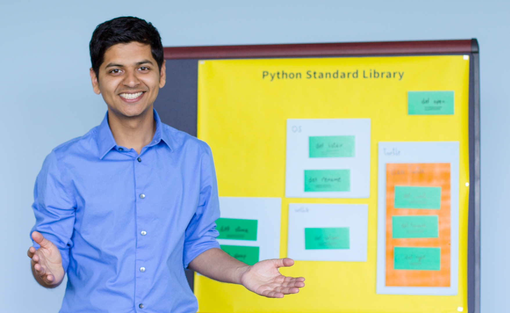
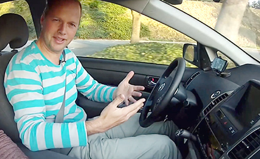

## 开篇

> Two roads diverged in a wood, and I	
I took the one less traveled by,	
And that has made all the difference.

> － Robert Frost - *The Road Not Taken*

在学习编程之前，我想我跟大多数人对编程的认识一样，觉得这只是众多需要专门技能职业中的一种。跟律师，医生，建筑师本质上并无不同，而且跟我的职业发展没有什么联系。我大学学的是西班牙语专业，毕业后也一直从事跟西班牙语相关的工作，周围人也很少有会编程的。虽然工作和生活已经被电脑手机互联网完全占领，却从没想过去了解这些应用、网站到底是怎么诞生的。

在我上一份工作的后期，因为接手了公司的新业务，需要管理大量商品以及零配件的进出、成本核算等等。Excel已经不能够高效地处理这些数据。我开始使用Bento，一个针对个人的数据库管理软件。但是Bento并不能与公司国外的同事进行数据共享。当时主要还是通过电子邮件发表格。因为时差关系，这样做不仅效率低，错误也再所难免。于是我开始寻找解决方案。在这个过程中，我逐渐了解到了：什么是关系型数据库、它与Excel的表格有什么不同，什么是数据库管理软件，什么是服务器，怎么划分用户权限，如何对数据库中的纪录进行增删读改，以及如何通过复合查询获取你需要的信息。

这让我认识到，原来我们每天都在和基于关系型数据库的应用在打交道，无论你是淘宝购物，微信聊天，还是去医院挂号。数据库无处不在。如果把应该放在数据库中的数据放在Excel里，再通过邮件发来发去，是如此地原始和低效。但在现实中，这正是绝大多数的中小企业所使用的信息沟通和共享的工具。

了解到了这些之后，我毫不犹豫地踏上了编程的修行之旅。

## 入门

很多跟我一样毫无基础的同学，在试图尝试学习编程的时候，面对如此众多的编程语言，总是无所适从。不知道哪门语言最简单，哪门语言用途最广，哪门语言赚钱最多或者哪门语言最强大。面对这样的疑问，Udaciy给出了一个系统的回答。

而我的编程第一课，是在[codecademy](https://www.codecademy.com/)上的。它提供了一个基于网页的互动开发环境(Interactive IDE)。如果你的大学英文还没完全还给老师，就可以按照它给出的文字指导，一步步的输入代码，查看返回结果。对到底什么是编程有个初步的了解。

完成了它上面的课程之后，如果感觉还不错，就可以正式开始学习编程学习了。要知道，仅仅是这上面的第一关，就已经把很多人挡在了外面。

现如今网络上有无数的编程入门教程，这里我推荐几个比较有特色的。

1. [Intro to Computer Science - Udacity](https://www.udacity.com/course/intro-to-computer-science--cs101)
	
    
  
    如果你想对计算机科学即有一个概念性了解，同时也想学习其中的细节。推荐你上一下Udacity的招牌课程，CS101。这门课程由Google的联合创始人Sergey Brin的采访开始，一步步手把手地教你如何打到一个搜索引擎。课程讲师Dave Evans作为Virginia大学的计算机教授，在讲解编程的基本概念的同时还能旁征博引，介绍了很多计算机科学发展过程中非常有意思的人和事。最后用一整个章节回顾过去展望未来，把所有你听过或者没听过的概念都梳理一遍。从此再谈到这些内容，你再也不会一脸无辜妆了。

2. [Introduction to Computer Science and Programming Using Python - Edx](https://www.edx.org/course/introduction-computer-science-mitx-6-00-1x-6)

    这是MIT计算机本科专业的入门课程。网易云课堂也能看到这门课的录像。Edx上的内容是MIT教授专门为网络授课而重新录制的。同时引入了很多在线练习，帮你巩固所讲过的知识。与Udacity的CS101不同，MIT的课程并没有讲网络编程。更多讲的是如何用计算思维来解决实际生活中遇到的问题。这门课更适合那些喜欢学术化的讲课风格，以及有考试压力才能学到东西的学生。

这两门课程所使用的语言都是Python。它语法简洁，优雅。通常完成一件事只有一种最好的写法。并且，做为解释型语言，比编译型语言更容易debug。

## 进阶

> Most good programmers do programming not because they expect to get paid or get adulation by the public, but because it is fun to program.
> 
> – Linux 创造者 Linus Torvalds

经过了入门阶段，相信你已经对编程各种常用的概念，有了相当清楚的了解。也认识到了计算机软件在解决实际问题中所展现的强大能力。这也坚定了你沿着这条路继续走下去的决心。

这时你也可以开始根据自己的兴趣，来选择你想要进阶的方向。

你可以选择对面向对象的编程进行更深一步的了解。Udacity的Kunal Chawla讲授的[Programming Foundations with Python](https://www.udacity.com/course/programming-foundations-with-python--ud036)绝对不会让你失望。

在此之前，我从没看到过如此生动活泼细致耐心的编程视频课程。如果说大部分的编程课程都像是高高在上的大学教授在教授它的学生。Kunal Chawla完全就像你身边的一个好朋友来教你编程。他会毫不吝惜的把他当初学习编程时遇到的困难，以及最终如何克服困难的过程告诉你。让你知道其实对复杂概念的理解，每个人都需要一个过程。也正是受了这门课程的感染，让我报名，并最终完成了Udacity的Full Stack Web Developer Nanodegree。

当然，虽然面相对象在业界用途最广，但这并不是唯一的编程范式。你也可以从函数式编程开始入手，慢慢过渡到面相对象编程。这里推荐两门课：

1. [Structure and Interpretation of Computer Programs (Self-Paced*) - Berkeley](http://www.cs61as.org/)

    如果说你听说过著名的魔法书[《程序的构造与解释》](https://en.wikipedia.org/wiki/Structure_and_Interpretation_of_Computer_Programs)，但被Lisp语言那一连串的括号吓跑了。通过伯克利Brian Harvey教授对SICP的重构，你完全可以把你放弃的魔法书重新拾起来。能真正吃透《程序的构造与解释》的人寥寥无几。但如果你真的做到了，递归，lambda，抽象，信息传递对你来说信手拈来。你还能见识到什么是代码即数据，数据及代码；什么是程序元编程；解释器、编译器的构造原理。真正做到知其然并知其所以然。有了这番洗礼，任何新的编程语言对你来说就只是[lisp的一种方言](http://www.ruanyifeng.com/blog/2010/10/why_lisp_is_superior.html)而已。

2. [Introduction to Functional Programming - Edx](https://www.edx.org/course/introduction-functional-programming-delftx-fp101x-0)

    这门课讲授的语言是被称为比lisp更为纯函数的语言：Haskell。这个前几年几乎要消失匿迹的语言近来开始焕发了新生。就连Facebook都用它来执行反垃圾评论的功能。即使不打算用于实际生产，Haskell也可以强化你对“类型”的思考。这种东西很难从其它常用的编程语言身上学到。

## 算法和数据结构

算法和数据结构通常是科班出身的程序员与野生程序员的分水岭。这当然不是说受过学校系统训练的一定好，自学的一定差。因为即使对CS专业的学生，这也是最难的课程之一。

之所以大家都会觉得算法难，是因为具有突破性的算法真的很难发明出来，业界通常几年才会出现一个有普遍影响力的新算法。另一方面在算法教学过程中，更多的是强调算法的实现，而非发明该算法的人当初在遇到类似问题时的解决思路。让学生普遍有死记硬背的感觉。

此外，众多框架，库以及API的普遍使用，把很多算法的实现掩盖到了底层。让人感觉在实际工作中，算法和数据结构的知识很少被用到。因此也就更加失去了对深入学习算法和数据结构的兴趣。大家之所依还在学，往往是因为这是大公司面试工程师不可或缺的一个环节。可以说，算法和数据结构是决定了你能否进入好的科技公司工作的必要条件，而框架使用是否熟练，影响到的仅仅是那不大的工资差距。

大家耳熟能祥的硅谷科技公司，像Google，Facebook，Linkedin，Dropbox，无论是电话还是onsite面试，都是直接让你白板写程序。一些新生的独角兽即使可以上机，考察的侧重点也是算法。所以这部分如果没有打好基础，第一关就很难过。这也是最近很多人在面试之前都需要刷面试题的原因。

之所以雇主会把这些工作中并不“常用”的内容作为考察的决定性因素。首先，一个人可以懂算法，但不经常使用，也不能在用的时候完全不会。其次，开源软件的广泛使用，使得公司竞争力的核心更多的集中在了特定算法的优势上。最后，也是最重要的一点：这个行业的特性决定了，重复发明轮子在这里无法生存。软件工程师最需要解决的问题，往往都是从来没有人解决过的。这也就要求程序员能够真正站在巨人的肩上，参考前人的智慧，创造性地提出新的解决方案。

系统性的掌握算法和数据结构是一个耗时并且有些枯燥的过程，这里推荐两个名校的课程，让你更加有欲望拿到这把金钥匙。

1. [Algorithms: Design and Analysis - Stanford](https://www.coursera.org/course/algo)
2. [Algorithms - Princeton](https://www.coursera.org/course/algs4partI)

## 实践

如果你不畏艰险的拿到了上面的金🔑，那么恭喜你，接下来你就可以尽情的施展才华了。无论你是要做网站，做游戏，做机器人，做数据分析，做并行分布式计算，做物联网，做机器学习，做人工智能。新的编程语言，最热门的技术，对别人而言仅仅是遥不可及的话题，对你却是可以切实进入的领域。这不代表你不再需要学习新的知识。恰恰相反，每个领域都有无数的内容等待你去学习。只是现在你可以在更高的高度审视这些新的工具，并把他们与脑中的理论知识融会贯通，对抽象的本质看的更清楚，使用起来也就更加得心应手，随心所欲。

要做到攻无不克，战无不胜，有几个大牛的课程非常值得你看一下：

1. [Intro to Artificial Intelligence - Udacity](https://www.udacity.com/course/intro-to-artificial-intelligence--cs271)
2. [Artificial Intelligence for Robotics - Udacity](https://www.udacity.com/course/artificial-intelligence-for-robotics--cs373)

    

    如果你对Google，Tesla，Apple正在研发的无人驾驶感兴趣，可以看下Udacity创始人Sebastian Thrun和Google研究主管Peter Norvig亲自讲授的这两门AI课程。

3. [Design of Computer Programs - Udacity](https://www.udacity.com/course/design-of-computer-programs--cs212)

	  Peter Norvig的另一门课程可以给你提供更多解决问题的思路和技巧。
	
4. [Programming Languages - Udacity](https://www.udacity.com/course/programming-languages--cs262)

    如果你认为JavaScript正在吞噬世界，不妨跟JavaScript之父Brendan Eich一起来看看浏览器到底是如何解释这门语言的。
  
5. [Web Development - Udacity](https://www.udacity.com/course/web-development--cs253)

    Wordpress一直用，wikipedia天天查，从没想过他们是怎么创造出来的。 reddit.com创始人Steve Huffman在这里让你抛开一切框架，让你从零开始一步一步打造自己的blog。

网络上的优秀课程实在数不胜数，这里仅仅列举了部分Udacity Nanodegree课程之外的例子。能够请出这些人为你讲课，足见Udacity的影响力。

## 解惑

尽管现如今网络上有这么多高质量的学习资源，不少同学在学习编程的过程中还是遇到些疑问。这里我结合自身学习的经验，给出一些参考意见。这绝不是唯一的正确答案。网络上的噪音很多，面对任何信息，每个人都应该批判性地阅读，而非盲目接受并相信。

1. 看视频效果好还是看书效果好？

    这个因人而异。当然，首先是要能够辨别好的学习内容。不然与花费的一点点金钱相比，浪费掉的时间是不可弥补的损失。看视频很生动，跟过去在学校学习时老师在课堂上讲课很类似，所以也更容易被人接受。但是视频的缺点是对知识点的追溯效率比较低，很难进行检索查找。所以在看的时候应该对重要的内容做好笔记。而且视频内容如果出错或者过时比较难以更新，所以文字或者文档是不可或缺的组成部分。
  
2. 很多东西学了就忘怎么办？

    对于概念性的东西，不要试图一下就囫囵吞枣。特别是第一次遇到的模式或概念，给自己一定的过程和时间，不要心急。对于一些命令和方法，常用的肯定都记住了。不常用的可以自己准备一个cheatsheet，可以是任何形式，只要用的时候很方便的拿出来查看，并且能够很方便的把想要记录的内容记录进去就好了。
  
3. 感觉debug很困难，没信心继续了

    首先，职业程序员在debug上花的时间也要比真正写程序的时间要多。所以这并不是你水平问题。其次，现如今各种高级语言和IDE都提供了很多debug工具。学会使用，事半功倍。最后，每一个bug都是你学习新东西的机会，也许是拼写失误，也许是某个细节理解错误。这个过程都可以帮助你提高水平。把debug看作提高水平的机会，才能保证有一个良好的心态。
  
4. 写程序靠天赋。

    中国人提到天赋往往跟聪明挂钩。特别是当说到孩子没有某某天赋的时候就说是没某某细胞。好像某某细胞真的存在似的。我不否认天赋的存在。但我更愿意把天赋和兴趣挂钩。Linux的创造者Linus Torvalds说：真正好的程序员编程不是为了赚钱成名，而是被编程本身的乐趣所吸引。

    二十年前，世界上最优秀的95%的软件是由那最顶尖5%的程序员写出的。现如今已经很难出现像Steve Wozniak或Linus Torvalds这样可以凭借一己之力打造一个操作系统的天才了。你用到的大部分软件都是由用软件工程的方式开发的。团队少则几个人，多则几千人，但都是协作的结果。如果你能进入一个优秀的团队，经过一定时间的历练，一定可以称为一个优秀的软件工程师。

5. 有没有最好的学习方法？

   没有绝对的。但下面几条是被认可度比较高的路径。
  
   1. Learn by doing
  
      不要光听讲，要多动手写。只有写出来，运行之后，从输入的结果得到了预期的输出结果。才算学到了东西。
    
   2. Learn by refactoring

      程序能跑过测试只是完成了第一步。每隔一段时间回顾一下过去写的代码，你会发现有很多地方可以写的更简短，更清晰，更健壮。因为随着你编码时间的增加，你会学到新的工具，用法，以及思想。把他们应用在你过去写过的代码中，你能明显感觉到自己的进步在哪里。
    
   3. Learn by sharing
  
      前面说过，算法面试题可以刷，但有两个硬性指标，再高级的程序员也是做不了假的。一是Github，二是Stack Overflow。如果你是某个流行的开源软件作者，或者核心贡献者；亦或者Stack Overflow的高分会员。工作对你来说是你挑公司，而不是公司挑你。即使这两项你都没有，但你能坚持写清楚明了的技术博客，日积月累地帮助别人也提高自己。不久就会收到心仪公司递过来的橄榄枝。

Udacity的Nanodegree的设计也符合了我以上提到的三条方法。他每一个Program都要求完成4-5个项目。这些项目要求你必须动手写代码，查资料，debug。它的人工评审系统可以在你提交作业之后2小时内给你反馈，告诉你哪里你写的好，哪里还可以进一步优化，以及哪里出现错误，需要重新提交。

它的论坛系统不仅可以让你的疑问的到导师的解答。你还可以看到与你共同学习的其它同学有哪些疑问。这其中哪些跟你遇到的问题一样，那些你已经明白，但是别人还蒙在鼓里。Udacity也鼓励你帮同学解答疑问。不要简单的给出答案，而要写出你分析问题的方法，以及为什么这么做的道理，以及其中涉及那些技术细节，这些你是从哪里学到的。

这些习惯如果能保持下来，对你今后的职业发展会有巨大的帮助。
  
## 写在最后

> The more you know, the more you know you don't know.
>
> Aristotle

不知你有没有发现这样一个规律，在任何一个领域中，越是顶尖的人士，越是低调和谦虚。这不是假惺惺的伪谦虚，因为只有站在已知领域的边缘，才会对未知世界产生的深深的敬畏。所以越是水平高的人，越是惜字如金，无论是写书还是做演讲，都深怕因为自己在某些方面的局限性而误导他人。

也因为高手的惜字如金，半瓶醋的人开始吵吵嚷嚷占领这个所谓的“编程市场”。打着各种旗号出版各种编程秘籍，举办各类XX语言大会，XX师大会，XX语言包就业速成班。打着学了XX就能包就业，拿高薪的口号来骗取那些渴望快速致富的年轻人钱财。

Peter Norvig在[《Teach Yourself Programming in Ten Years》](http://norvig.com/21-days.html) [(中译)](http://daiyuwen.freeshell.org/gb/misc/21-days-cn.html)中讽刺了市面上充斥的各种《XX天精通XX》的书籍。他说要想真正掌握这门技能，至少要学习半打的编程语言。包括一种支持类抽象的语言（象Java 或C++），一种支持函数化抽象的语言（象Lisp或ML），一种支持语法抽象的语言（象 Lisp），一种支持声明规格说明的语言（象Prolog或C++ 的模板），一种支持共行程序（coroutine）的语言（象Icon或Scheme），一种支持并行的语言（象Sisal）。

魔法书的作者之一，MIT教授Harold Abelson，1986年受邀去惠普讲课。在开篇时提到：很多人对计算机科学的认识仅仅停留在如何使用计算机上。这跟古埃及人对几何学的认识很相近。那时的古埃及人认为几何学就是学习如何用仪器来测量土地。几千年之后的我们才意识到，当初古埃及人这个行为所包涵真正意义是人类开始对时间和空间进行形式化的表述，并归纳出一套讨论数学真理的形式化方法。这直接导致了公理化方法，以及各种现代数学的产生。同时也指明了一种精确讨论所谓的描述真理的陈述性知识的方法。

未来的人们也会同样的眼光来审视二十一世纪的我们。说他们虽然看起来是在摆弄计算机和手机，实际上是在开始学习如何去对计算过程进行形式化的表述，如何去解决问题。把这两者相结合，发展一套对问题处理过程精确表述的方法。

这篇文章不仅仅让你对Udacity有所认识，更希望你能在编程学习这个并不平坦的道理上，越走越顺，到达你理想中的目的地。