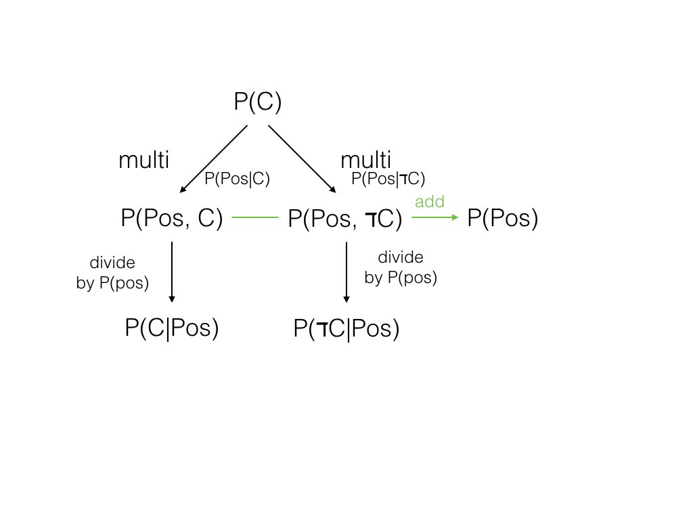

## Cancer Test

有一种癌症在人群中的发病率是1%。

P(C) = 0.01

对这个癌症的检测：

- 如果你患有这个癌症，有90%的几率检测结果是positive。这也被称作test的sensitivity。
- 如果你不患有这个癌症，有90%的几率检测结果是negative。这也被称作test的specificity。

问题：如果你做了检测，结果是positive，那门你患有这个癌症的可能性有多大？

要回答这个问题，我们首先看在总的人群中，有1％的人患有这个癌症，99%的人没有。我们还知道，对患有癌症人的test的准确率是90%。也就是说患有癌症，并被准确测试出来的概率是1% × 90%，也就是0.009，或者说0.9%。

99%的没患病的人中，会有10%的人的检测结果是positive，在总人群中的概率是99% × 10%，9.9%。

也就是说有100% - 9.9% - 0.9% ＝ 89.2%的人，既没有患癌症，检测结果也是negative。

0.9% ＋ 9.9% 是检测呈positive人的

Bayes Rule 总的来说就是 incorporate some evidence from a test into your prior probability to arrive at a posterior probability.

用Cancer的例子来说

```
prior:  	P(C) = 0.01     = 1%
        	P(Pos|C) = 0.9  = 90%
        	P(ℸC) = 0.99
        	P(Neg|ℸC) = 0.9
        	P(Pos|ℸC) = 0.1
joint:      P(C, Pos) = P(C) • P(Pos|C) = 0.01*0.9 = 0.009
            P(ℸC, Pos) = P(ℸC)• P(Pos|ℸC) = 0.99 * 0.1 = 0.099
Normalize:  P(Pos) = P(C, Pos) + P(ℸC, Pos) = 0.009 + 0.099 = 0.108
posterior:  P(C|Pos) = P(C, Pos)/P(Pos) = 0.009/0.108 = 0.0833
            P(ℸC|Pos) = P(ℸC, Pos)/P(Pos) = 0.099/0.108 = 0.9167
```

1000个人，其中10个人有C，其中9人（C ＋ Pos），1人（C ＋ Neg）

990人无C，其中99人（－C＋Pos）。

得出的概率是9／（99+9）＝0.08333

总结一下


## Text Learning - Naive Bayes

现在假设有2个人，Chris和Sara。

Chris邮件中，Love 10%，Deal 80%，Life 10%。

```
P(Love | Chris) = 0.1
P(Deal | Chris) = 0.8
P(Life | Chris) = 0.1
```

Sara邮件中，Love 50%，Deal 20%，Life 30%。

P(Chris) = 0.5

P(Sara) = 0.5

如果一封邮件的内容是 "Life deal"， 这封邮件是Chris的的概率是：

P(Chris \| email is "life deal") = 0.1 * 0.8 * 0.5 = 0.04

是Sara的概率是：

0.3 * 0.2 * 0.5 = 0.03

P(Chris \| "Life deal") = 0.04/(0.03+0.04) = 0.57

P(Sara \| "Life deal") = 0.03/(0.03+0.04) = 0.43

如果邮件内容是"life life deal"，是Chris的概率就变成了

0.1 * 0.1 * 0.8 * 0.5 = 0.004

是Sara的概率是：

0.3 * 0.3 * 0.2 * 0.5 = 0.009

