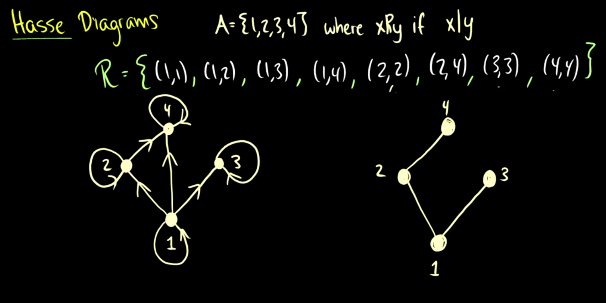
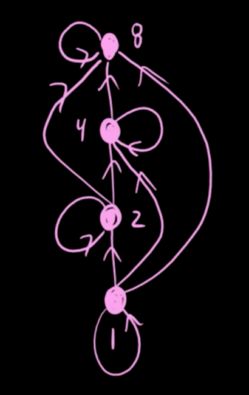
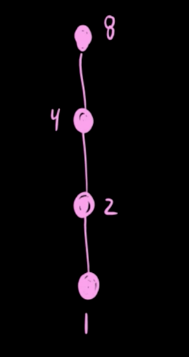

### Partial Order

A _partial order_ on a set $$A$$ is a relation that is

- Reflexive
- Antisymmetric
- Transitive

A set $$A$$ together with a partial order $$\preceq$$ on $$A$$ is called a _partially ordered set_ (or simply _poset_) and is denoted as $$(A;\preceq)$$.

e.g. $$A = \{1, 2, 3, 4\}$$, where $$x\ R\ y$$ if $$x$$ divides $$y$$

$$R = \{(1,1),(1,2),(1,3),(1,4),(2,2),(2,4),(3,3),(4,4)\}$$

Diagram can be draw as:

### Comparable

For a poset $$(A;\preceq)$$, two elements $$a$$ and $$b$$ are called _comparable_ if $$a \preceq b$$ or $$ b \preceq a$$, otherwise they are called _incomparable_.

### Totally ordered

if $$A = \{1, 2, 4, 8\}$$, using the same relation

$$R = \{(1,1),(1,2),(1,4),(1,8),(2,2),(2,4),(2,8),(4,4),(4,8),(8,8)\}$$

If any two elements of a poset $$(A; \preceq)$$ are comparable, then A is called _totally ordered_ (or linearly ordered) by $$\preceq$$.
 

### Well ordered

Definition: A poset $$(A;\preceq)$$ is _well-ordered_ if it is totally ordered and if every non-empty subset of A has a [least element](https://nickyfoto.github.io/blog/entries/special-elements-in-posets).

### Cover

In a poset $$(A;\preceq)$$ an element $$b$$ is said to _cover_ an element a if $$a \prec b$$ and there exists no $$c$$ with $$a \prec c$$ and $$c \prec b$$ (i.e. between $$a$$ and $$b$$).

### Hasse Diagram

The _Hass Diagram_ of a (finite) poset $$(A;\preceq)$$ is the directed graph whose vertices are labeled with elements of $$A$$ and where there is an edge from $$a$$ to $$b$$ if and only if $$b$$ covers $$a$$.

if $$A = \{1,2,3,4,5,6,7,8\}$$, the Hasse diagram is:

The covering relation is {(1,2),(1,3),(1,5),(1,7),(2,4),(2,6),(3,6),(4,8)}

https://www.youtube.com/watch?v=R36F8CWAi2k

https://math.stackexchange.com/questions/238675/constructing-a-hasse-diagram-using-the-covering-relation