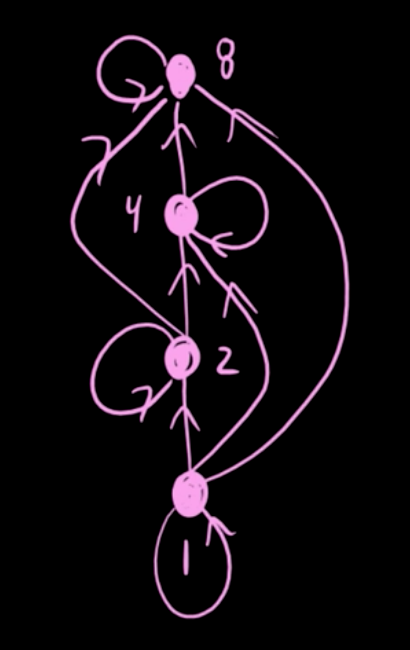
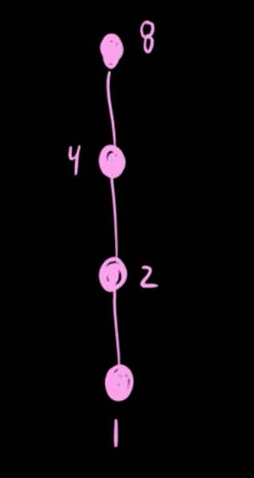

### Partial Order

A partial order is defined as a relation which is

- Antisymmetric
- Reflexive
- Transitive

e.g. $$A = \{1, 2, 3, 4\}$$, where $$xRy$$ if $$x$$ divides $$y$$

$$R = \{(1,1),(1,2),(1,3),(1,4),(2,2),(2,4),(3,3),(4,4)\}$$

Diagram can be draw as:

### Total order

if $$A = \{1, 2, 4, 8\}$$, using the same relation

$$R = \{(1,1),(1,2),(1,4),(1,8),(2,2),(2,4),(2,8),(4,4),(4,8),(8,8)\}$$

If any two elements of a poset $$(A; \preceq)$$ are comparable, then A is called _totally ordered_ (or linearly ordered) by $$\preceq$$.
 

### Covering relation

if $$A = \{1,2,3,4,5,6,7,8\}$$, the Hasse diagram is:

The covering relation is {(1,2),(1,3),(1,5),(1,7),(2,4),(2,6),(3,6),(4,8)}

https://www.youtube.com/watch?v=R36F8CWAi2k

https://math.stackexchange.com/questions/238675/constructing-a-hasse-diagram-using-the-covering-relation