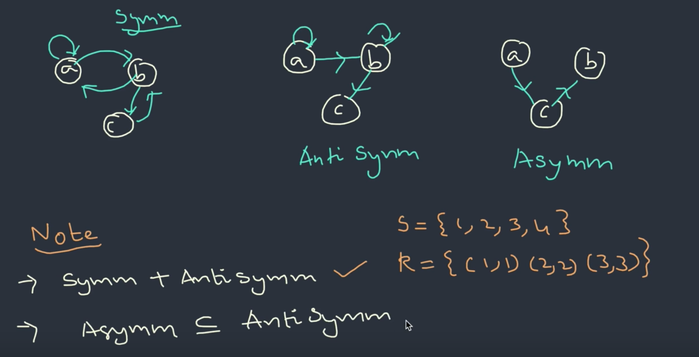

$$A = \{1, 2, 3\}$$

R | reflexive | irreflexive | symmetric | antisymmetric | asymmetric | transitive
------------ | ------------- | --- | --- |--- | --- | ---
$$\phi$$ | ❎ | ✅ | ✅ | ✅ | ✅ | ✅
$$A \times A$$ | ✅ | ❎ | ✅ | ❎ | ❎ | ✅
{(1,1),(2,2),(3,3)} | ✅ | ❎ | ✅ | ✅ | ❎ | ✅
{(1,2),(2,1),(1,1)} | ❎ | ❎ | ✅ | ❎ | ❎ | ✅
{(1,2),(2,1),(1,1),(2,2)}| ❎ | ❎ | ✅ | ❎ | ❎ | ✅ 
{(1,2),(2,3),(1,3)}| ❎ | ✅ | ❎ | ✅ | ✅ | ✅
{(2,3),(1,3),(1,1)}| ❎ | ❎ | ❎ | ✅ | ❎ | ✅
{(3,1),(1,3),(2,3)} |❎ | ✅ | ❎ | ❎ | ❎ | ❎
{(2,1),(2,3),(1,1)}| ❎ | ❎ | ❎ | ✅ | ❎ | ✅
{(2,3),(3,2),(2,2),(3,3)}| ❎ | ❎ | ✅ | ❎ | ❎ | ✅
{(1,1),(2,2),(2,3),(1,3)} | ❎ | ❎ | ❎ | ✅ | ❎ |✅
{(1,2),(2,1),(2,3)} | ❎ | ✅ | ❎ | ❎ | ❎ | ❎
{(1,1),(2,1),(1,2),(2,3)} | ❎ | ❎ | ❎ | ❎ | ❎ | ✅
{(1,2),(1,3)} | ❎ | ✅ | ❎ | ✅ | ✅ | ✅
{(2, 3)} | ❎ | ✅ | ❎ | ✅ | ✅ | ✅
{(1,2),(2,1)} | ❎ | ✅ | ✅ | ❎ | ❎ | ❎

identity: $$id_A = \{(a,a)\ |\ a \in A\}$$

reflexive: all diagonal element must be present. $$\forall x \{x \in S \Rightarrow (x,x) \in R\}$$

irreflexive: non diagonal element can present. $$\forall x \{x \in S \Rightarrow (x,x) \not\in R\}$$

symmetric: if $$(a, b) \in R$$, $$(b, a)$$ must $$\in R$$, $$a $$ can $$=b $$

antisymmetric: if $$(a, b) \in R$$ and $$(b, a) \in R$$, then $$a$$ must $$=b$$.

asymmetric: if $$(a, b) \in R$$, then $$(b, a) \not\in R$$, even if $$a = b$$. 

transitive: if $$(a, b) \in R$$ and $$(b, c) \in R$$, then $$(a, c)$$ must $$\in R$$

Using Graph representation

symmetric: if $$a \rightarrow b$$, then must have $$b \rightarrow a$$, $$a \rightarrow a$$ is permitted.

antisymmetric: if $$a \rightarrow b$$, then must **not** have $$b \rightarrow a$$, $$a \rightarrow a$$ is permitted.

asymmetric: if $$a \rightarrow b$$, then must **not** have $$b \rightarrow a$$, $$a \rightarrow a$$ is **not** permitted.

asymmetric $$\subseteq$$ antisymmetric